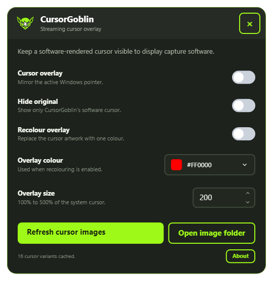

# CursorGoblin

CursorGoblin is a small, Windows-only cursor overlay for streaming and screen-capture workflows. It draws a software-rendered, always-on-top, click-through copy over the active Windows cursor, including pointer, hand, text, wait, and resize variants. Its floating settings window is built with CupriFace.



The original project artwork is stored in `Assets\CursorGoblin.png`; `tools\Create-Icon.ps1` creates the multi-resolution Windows icon used by the executable and configuration form. The artwork was generated specifically for CursorGoblin and does not use third-party icon assets.

## Features

- Mirrors the cursor currently selected by Windows.
- Keeps the overlay topmost, non-activating, and click-through, and actively reasserts its topmost position while running.
- Optionally hides the original Windows cursor.
- Recolours the overlay to a solid chosen colour while retaining transparency.
- Scales the overlay from 100% to 500%.
- Exports the active standard Windows cursor variants as PNG files and refreshes them on demand.
- Saves settings under `%LOCALAPPDATA%\CursorGoblin`.
- Provides a compact, GPU-rendered settings window that closes back to the notification area.

The same in-memory images used by the overlay are exported to the PNG cache. The live cursor handle is also accepted as a fallback, so application-specific cursors that are not one of the standard cached variants still appear.

## Using CursorGoblin

Launch `CursorGoblin.exe` and leave it running while recording or streaming. The cursor
overlay does not accept mouse input and stays above ordinary windows. Closing the settings
window hides it; use the notification-area icon to reopen it or select **Exit CursorGoblin**
to stop the overlay completely.

| Setting | Purpose |
|---|---|
| Cursor overlay | Enables or disables the software-rendered cursor. |
| Hide original | Hides the Windows cursor so only CursorGoblin's version remains visible. |
| Recolour overlay | Replaces the cursor artwork with the selected solid colour. |
| Overlay colour | Opens a palette and stores the colour used by recolouring. |
| Overlay size | Scales the copied cursor from 100% to 500%. |
| Refresh cursor images | Reloads the standard cursor variants after the Windows cursor theme changes. |
| Open image folder | Opens the exported PNG cache for inspection. |
| About | Shows application information and a link to the CursorGoblin GitHub repository. |

Settings are applied immediately and persist between launches. The status line reports the
number of cached cursor variants without exposing the local cache path.

## Cursor images

At startup, CursorGoblin loads the standard Windows pointer variants and caches equivalent
PNG images under `%LOCALAPPDATA%\CursorGoblin\Cursors`. Choose **Refresh cursor images** after
editing or changing the Windows cursor theme. CursorGoblin also accepts the live cursor handle
as a fallback for application-specific cursors that are not part of the standard set.

## Development

Requires the .NET 10 SDK on Windows.

```powershell
dotnet build .\CursorGoblin.csproj
dotnet run --project .\CursorGoblin.csproj
```

CursorGoblin uses the released `CupriFace.Shell` 0.23.0 NuGet package. The package and its
transitive `CupriFace` dependency are vendored from the corresponding GitHub release so
local and CI builds do not need GitHub Packages credentials. See
[`packages/README.md`](packages/README.md) for provenance and update instructions.
CursorGoblin declares Per-Monitor-V2 awareness and uses CupriFace's device-scale tracking
for crisp logical sizing across monitors.

### Rendering architecture

The settings window uses CupriFace's off-screen GPU rendering with native Windows per-pixel alpha, released after [CupriFace PR #140](https://github.com/Wixely/CupriFace/pull/140). Skia draws on the GPU, then reads changed frames back for Windows alpha presentation. This avoids black transparent margins reproduced with the normal OpenGL swap chain on the tested Windows 11 machine. It is GPU-accelerated drawing with a CPU presentation copy, not a zero-copy DirectComposition backend. Idle windows do not repeatedly render or read back. The separate always-on-top cursor overlay is unchanged.

Use the VS Code `Build` task or `Launch CursorGoblin` debug configuration for interactive development.

For a non-interactive cache, rendering, binding, colour-palette, and modal smoke test, run
`CursorGoblin.exe --smoke-test`. Add `--snapshot <path.png>` to save a headless CupriFace
settings render. The checked-in screenshot above is generated through that path.

## Publish

The project is configured for a self-contained, single-file Windows x64 executable:

```powershell
dotnet publish .\CursorGoblin.csproj -c Release
```

The result is written below `bin\Release\net10.0-windows\win-x64\publish`.

NativeAOT and trimming remain disabled; changing the settings presentation path does not establish AOT/trimming compatibility for the remaining dependencies. The executable embeds the .NET runtime.

## Troubleshooting

- If the settings window has transparency or GPU-driver problems, set
  `CUPRIFACE_SOFTWARE=1` before launching to use CupriFace's fully software-rendered alpha
  path. The startup diagnostic identifies the active renderer.
- If Windows cursor artwork changes while CursorGoblin is open, choose **Refresh cursor
  images**.
- If the original cursor remains hidden after an interrupted debug session, signing out or
  restarting Windows restores the system cursor display count.

## Safety note

Cursor hiding is restored when the application exits normally. During development, stop the application normally rather than terminating it abruptly. If an interrupted debug session leaves the Windows cursor hidden, signing out or restarting Windows restores the display state.

## License

CursorGoblin is available under the [MIT License](LICENSE).
